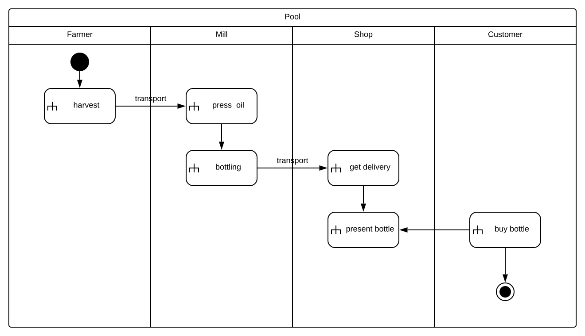
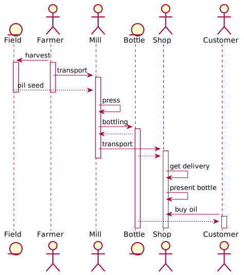
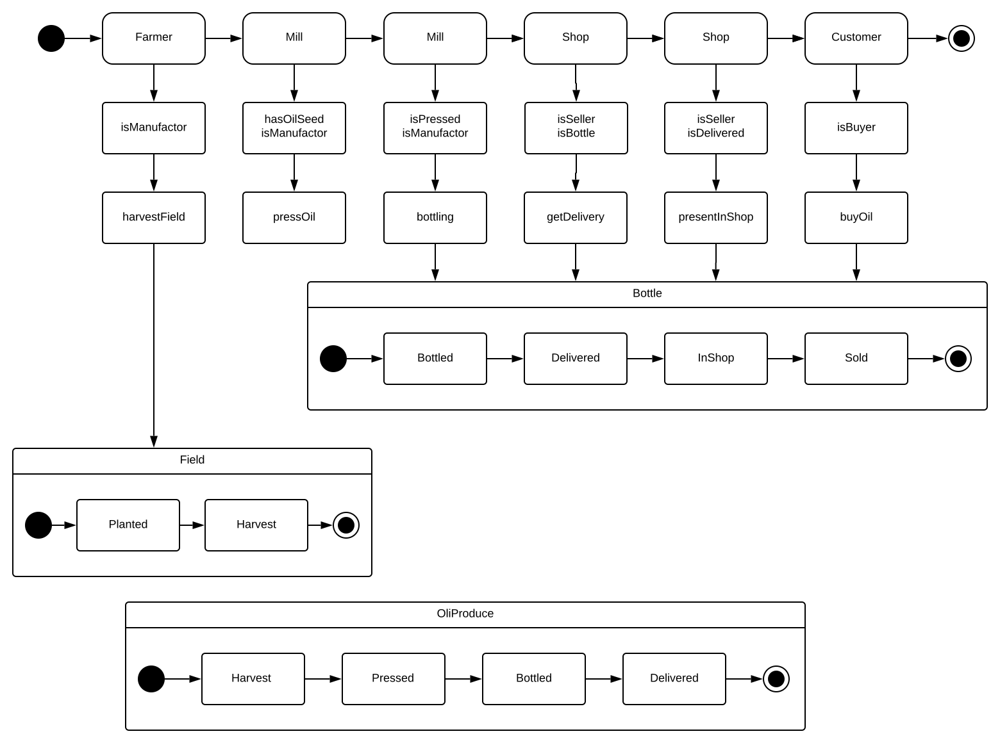
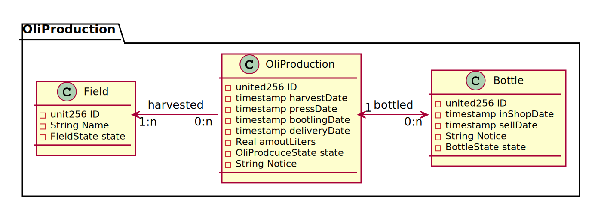
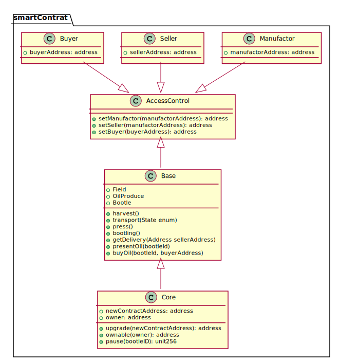

# organicOil
Organic oil manufacturer Ethereum Blockchain example

## Story
The organic farmer Bob produces exclusive rapeseed oils.  Bob presses the oils in a nearby rapeseed mill. Afterward, he sells the oils at the farm shop.   The oil is bottling in one-liter bottles, and each bottle has a unique identity code. Farming and the Farm store (selling) are separate concerns.  When Bob plans to produce oil, he harvests one or more fields and transports the seed to the mill. The mill pressed and bottled the oil. Bob will do all administrative stuff for the mill.

This example shows the possibilities of tracking of products like wine, beer, bread, or products in chemical or pharmaceutical industries. It tracks the products from the field to the customer. The example has one primary essence and two production steps.

## Activity Diagram

This Activity Diagram identifies the main activities for each actor in the oil production process.

## Sequence Diagram

## State Diagram

## Data Model

### Business Logic

### SmartContract Logic

